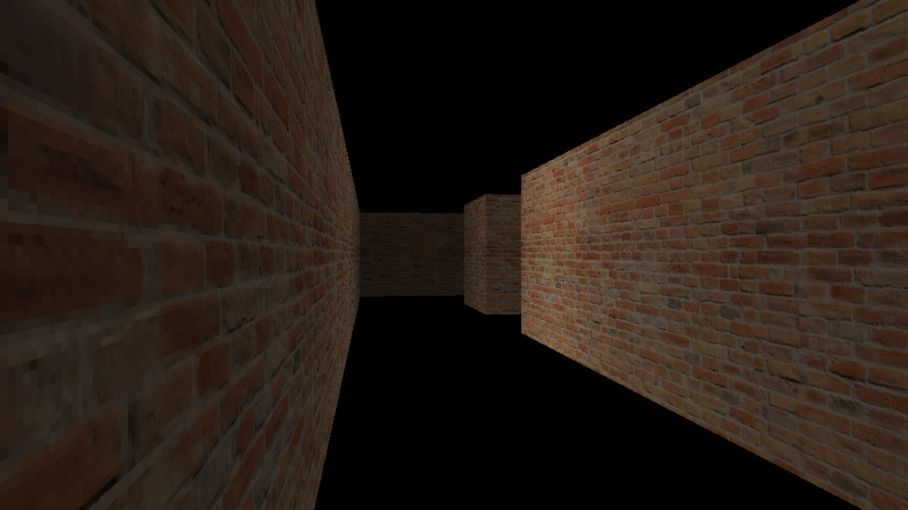
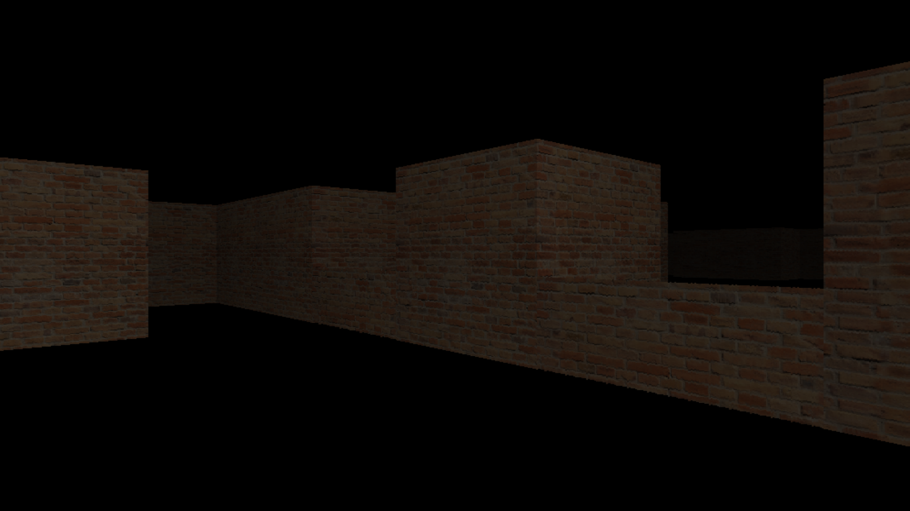

<h1 align="center">reicaster</h1>
<p align="center">
	
	<a href="./LICENSE">
		
	</a>
	<a href="https://github.com/LordOfTrident/reicaster/issues">
		
	</a>
	<a href="https://github.com/LordOfTrident/reicaster/pulls">
		
	</a>
	<br><br><br>
</p>

A 3D C++ [raycaster](https://en.wikipedia.org/wiki/Ray_casting) written in C++ with [SDL2](https://www.libsdl.org/),
using the [DDA algorithm](https://lodev.org/cgtutor/raycasting.html).

Clone with
```sh
$ git clone --recurse-submodules https://github.com/lordoftrident/reicaster
```

## Table of contents
* [Quickstart](#quickstart)
* [Dependencies](#dependencies)
* [Milestones](#milestones)
* [TODO](#todo)
* [Bugs](#bugs)

## Quickstart
Bootstrap the builder with
```sh
$ cc build.c -o build
```
And then use it to build the project
```sh
$ ./build
```

## Dependencies
- [SDL2](https://www.libsdl.org/)

## Milestones
- [X] 3D rendering
- [X] Textured walls
- [X] Slabs
- [ ] Sky
- [ ] Jumping on slabs (z collision)
- [ ] Textured floor, ceiling
- [ ] Doors, thin walls with transparency
- [ ] Lighting system (possibly with shadow casting)

## TODO
- [ ] All of the milestones
- [ ] Proper z player position and velocity
- [ ] Proper mouse look
- [ ] Comment source code
- [ ] Wall x and y size and position inside a block property
- [ ] A wall property to attach it either to floor or ceiling (for DOOM-like doors)
- [ ] DOOM-like doors (sliding up using the wall height and z position property)

## Bugs
If you find any bugs, please create an issue and report them.

<p align="center">
	
	
</p>
