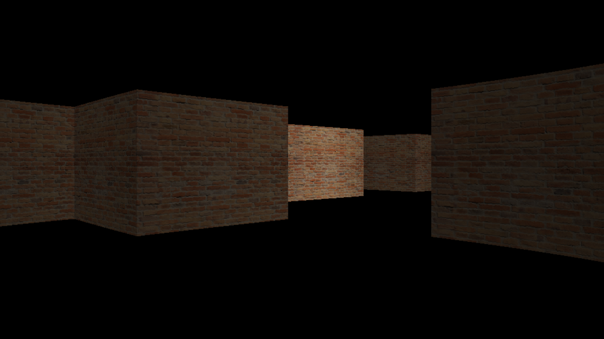

<h1 align="center">Ray3D</h1>
<p align="center">
	
	<a href="./LICENSE">
		
	</a>
	<a href="https://github.com/LordOfTrident/ray3d/issues">
		
	</a>
	<a href="https://github.com/LordOfTrident/ray3d/pulls">
		
	</a>
	<br><br><br>
</p>

A 3D C++ [raycaster](https://en.wikipedia.org/wiki/Ray_casting) written in C++ with [SDL2](https://www.libsdl.org/),
using the [DDA algorithm](https://lodev.org/cgtutor/raycasting.html).

Clone with
```sh
$ git clone --recurse-submodules https://github.com/lordoftrident/ray3d
```

## Table of contents
* [Quickstart](#quickstart)
* [Dependencies](#dependencies)
* [Bugs](#bugs)

## Quickstart
Bootstrap the builder with
```sh
$ cc build.c -o build
```
And then use it to build the project
```sh
$ ./build
```

## Dependencies
- [SDL2](https://www.libsdl.org/)

## Bugs
If you find any bugs, please create an issue and report them.
